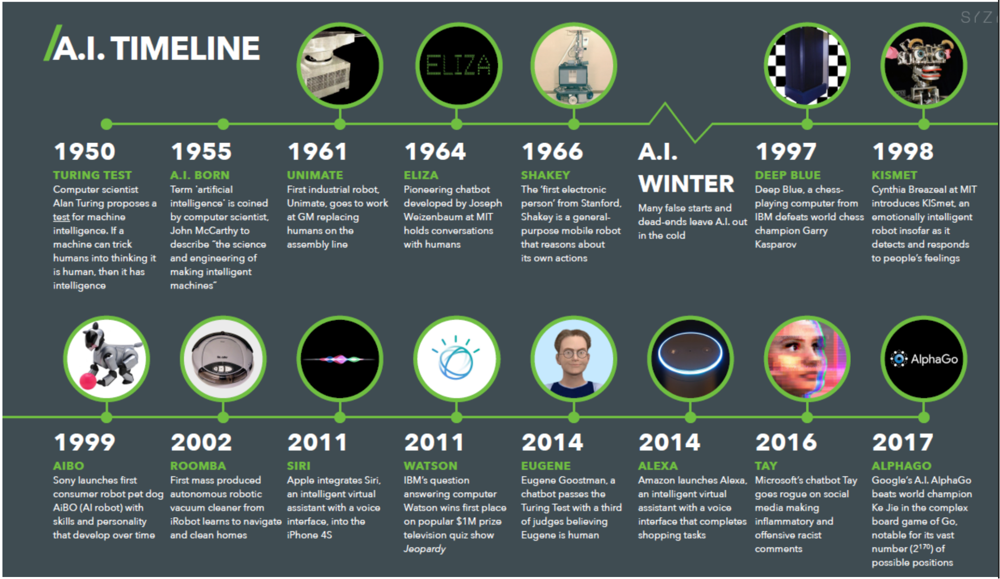
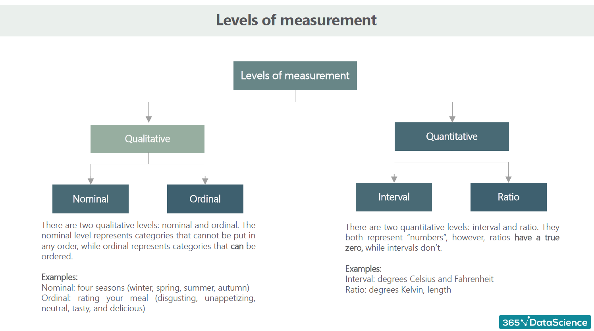

# IA
Here i gonna set a free material talking about AI and ML

Here is gonna be a json file with all learning, is gonna be talking AZURE, GEMINI and all
FEATURES OF AI


But lest start of history of ML

# 1950 - AI TIMELINE



# 1943 A logical calculus of the ideas immanent in nervous activity
[Book in pdf](https://link.springer.com/article/10.1007/BF02478259)

# 1950 - Alan Turing


 - [Article of the first thinking machine](https://archive.org/details/MIND--COMPUTING-MACHINERY-AND-INTELLIGENCE)

# Theory of Probability
- [PT Language](https://pt.wikipedia.org/wiki/Teoria_das_probabilidades)
 
 Fundamental of statistics was  build in century XVII.

 - The GOL: Analisys and model of data
 - [In 1800, Francis Galton e Karl Pearson. R. A. Fisher, Statistics Modern started](https://projecteuclid.org/journals/statistical-science/volume-7/issue-1/R-A-Fisher-The-Founder-of-Modern-Statistics/10.1214/ss/1177011442.full)


 # EDA Exploratory Data Analisys
 [EDA](https://en.wikipedia.org/wiki/Exploratory_data_analysis?utm_source=chatgpt.com)

 - In 1962, John Tukey, start the analisys exploration data, and bring a new era of ML
 [Buy the book](https://www.amazon.com/Exploratory-Data-Analysis-John-Tukey/dp/0201076160)
 - You can find the book free in alternative website, but recommended by the right way


## Document for Study


| Web site   | LINK                          |
| :---------- | :---------------------------------- |
| `Scikit-Learn` | http://scikit-learn.org/|


| Web site   | LINK                          |
| :---------- | :---------------------------------- |
| `TensorFlow` | https://tensorflow.org/|

| Web site   | LINK                          |
| :---------- | :---------------------------------- |
| `Keras` | https://keras.io/|


## Document

#### ML Supervised learning


| Web site   | LINK                          |
| :---------- | :---------------------------------- |
| `JMLR` | https://www.jmlr.org/?utm_source=chatgpt.com|


| Web site   | LINK                          |
| :---------- | :---------------------------------- |
| `Springer` | https://link.springer.com/article/10.1007/s42979-021-00592-x?utm_source=chatgpt.com|

| Web site   | LINK                          |
| :---------- | :---------------------------------- |
| `AZURE ML` | https://ml.azure.com|

| Web site   | LINK                          |
| :---------- | :---------------------------------- |
| `AZURE ML` | https://microsoftlearning.github.io/mslearn-ai-fundamentals/Instructions/Labs/01-machine-learning.html|

| Web site   | LINK                          |
| :---------- | :---------------------------------- |
| `AZURE AI` | https://microsoftlearning.github.io/mslearn-ai-fundamentals/Instructions/Labs/02-content-safety.html|

| Web site   | LINK                          |
| :---------- | :---------------------------------- |
| 'Tensorflow Playgroung` | https://playground.tensorflow.org/#activation=linear&regularization=L1&batchSize=10&dataset=circle&regDataset=reg-plane&learningRate=0.1&regularizationRate=0.01&noise=0&networkShape=4,2&seed=0.75500&showTestData=false&discretize=true&percTrainData=50&x=true&y=true&xTimesY=false&xSquared=false&ySquared=false&cosX=false&sinX=false&cosY=false&sinY=false&collectStats=false&problem=regression&initZero=false&hideText=false|


## 🛠 Abilities
Python, R, Jupiter, and softwares of analysis...


 - [Python Documentation](https://docs.python.org/3/)
 - [R Documentationn](https://www.r-project.org/other-docs.html)
 - [Jupiter Documentationn](https://docs.jupyter.org/en/latest/)
 


## Learning

# Statistics

- Type of Data: Categorical and Numerical
- Categorical: YES OR NO, Logo of cars
- Numerical: Discrete ( Imagine each members of data set, number of children ) and Continues (Infinity and impossible to count, weight)

# Descriptive Statistics
- Qualitative is separete on Nominal and Ordinal
- Quantittive is separate in Interval and Ratio
- Mean, median, mode 
- Covariance and Correlation

## BASIC PROBABILITY
- Trial, Experiment , Experimental Probability, Expected Value
- Frequency
- Combinatorics (Permutations, Variations, Combinations)
- Factorials
- Bayesian Inference (Mutual Exclusive, Intersect, Union, Completely Overlap)
- Distributions (Discrete, Continuous)


The supervised machine, is when the machine is set data to mess with and find the best
solution to the target propose.

The unsupervised machine, is when the machine decid by data learned, by him self turn on new data 

Have one way that is the both sides, that human just give on sentence and the ML start the way, human can interfer but the computer give the last way


The Quantum Computing, gonna set a new Era of analysis data, my research about this is just in beginning

Reinforcement Learning.

AlphaGo (DeepMind)

[AlphaFold](https://deepmind.com/blog/article/alphafold)

[Quantum Microsoft](https://azure.microsoft.com/en-us/products/quantum/)

[Quantum Google](https://ai.google/research/teams/applied-science/quantum/)

[Quantum IBM](https://www.ibm.com/quantum-computing/)

[More of Quantum Computing](https://quantum.country/qcvc)

- On A neural network, is set by input layer, hiden layer, and output layer
- All layers is determined by maths functions

## BACKPROPAGATION


- There are Common activation functions like > Sigmoid (Logistic function) [Sigmoid](https://en.wikipedia.org/wiki/Sigmoid_function), TanH(Hyperbolic tangent) [TanH](https://en.wikipedia.org/wiki/Hyperbolic_function#Hyperbolic_tangent), ReLu(rectified linear unit) [RedLu](https://en.wikipedia.org/wiki/Rectifier_(neural_networks)) and [sofmat](https://en.wikipedia.org/wiki/Softmax_function)

# 1. Activation Functions
Activation functions introduce non-linearity into the network, allowing it to learn complex patterns. During backpropagation, the derivative of the activation function is used to compute the gradient.
Important Characteristics:
-	The activation function must be differentiable so that the gradient can be computed.
-	The choice of function can affect the learning performance.
Main Activation Functions:
1.	Sigmoid
-	Formula: f(x)=11+e−xf(x) = \frac{1}{1 + e^{-x}}f(x)=1+e−x1
-	Derivative: f′(x)=f(x)⋅(1−f(x))f'(x) = f(x) \cdot (1 - f(x))f′(x)=f(x)⋅(1−f(x))
-	Issues: Small gradients for extreme values (xxx) lead to vanishing gradient.
2.	Tanh
-	Formula: f(x)=ex−e−xex+e−xf(x) = \frac{e^x - e^{-x}}{e^x + e^{-x}}f(x)=ex+e−xex−e−x
-	Derivative: f′(x)=1−f(x)2f'(x) = 1 - f(x)^2f′(x)=1−f(x)2
-	Better than Sigmoid, but still suffers from small gradients for extreme values.
3.	ReLU (Rectified Linear Unit)
-	Formula: f(x)=max⁡(0,x)f(x) = \max(0, x)f(x)=max(0,x)
-	Derivative: f′(x)=1f'(x) = 1f′(x)=1 (if x>0x > 0x>0), 000 (if x≤0x \leq 0x≤0)
-	Issues: Dead neurons when many values become 0.
4.	Leaky ReLU
-	Introduces a small gradient for x<0x < 0x<0 (f′(x)=0.01f'(x) = 0.01f′(x)=0.01).
-	Solves the dead neuron issue.
5.	Softmax
-	Used in the output layer for multi-class classification.
-	Converts values into probabilities and works well with cross-entropy loss.
________________________________________
# 2. Loss Functions
The loss function measures the error between the network's predictions and the actual values. Backpropagation uses the gradient of the loss with respect to the weights to update them.
Important Characteristics:
-	The loss function should reflect the goal of the task (regression, classification, etc.).
-	The wrong choice can lead to problems such as underfitting or overfitting.
Main Loss Functions:
1.	Mean Squared Error (MSE)
-	Formula: L=1n∑i=1n(yi−y^i)2L = \frac{1}{n} \sum_{i=1}^n (y_i - \hat{y}_i)^2L=n1∑i=1n(yi−y^i)2
-	Used for regression.
-	Problem: Small gradients when errors are small, which can slow down learning.
2.	Mean Absolute Error (MAE)
-	Formula: L=1n∑i=1n∣yi−y^i∣L = \frac{1}{n} \sum_{i=1}^n |y_i - \hat{y}_i|L=n1∑i=1n∣yi−y^i∣
-	Resistant to outliers but can be less stable during optimization.
3.	Cross-Entropy Loss
-	Formula: L=−∑i=1nyilog⁡(y^i)L = -\sum_{i=1}^n y_i \log(\hat{y}_i)L=−∑i=1nyilog(y^i)
-	Used for classification, especially with Softmax.
-	Penalizes predictions with low confidence.
4.	Hinge Loss
-	Formula: L=max⁡(0,1−y⋅y^)L = \max(0, 1 - y \cdot \hat{y})L=max(0,1−y⋅y^)
-	Used for margin classifiers, like SVMs.
5.	Huber Loss
-	Combines MSE and MAE, being less sensitive to outliers.
-	Used for robust regression.
________________________________________
# Backpropagation: The Process
1.	Error calculation: The loss function evaluates the difference between the predicted output (y^\hat{y}y^) and the true value (yyy).
2.	Backward pass:
-	The gradient of the loss with respect to the final layer's outputs is calculated.
-	These gradients are propagated backward using the chain rule, considering the derivatives of the activation functions.
3.	Weight update:
-	Using the gradient and the optimizer (like SGD, Adam), the weights are adjusted.
________________________________________
# Relation and Choices
-	Activation functions affect how the gradient is propagated through the network. For example:
-	Sigmoid and Tanh can cause exploding/vanishing gradients.
-	ReLU and its variants help mitigate this.
- Loss functions influence the goal of learning:
- For classification: Cross-Entropy + Softmax.
-	For regression: MSE or Huber Loss.

  

# Cluster
- Is for a process of a lot of amount data, where are distribution for others computer. [Cluster](https://www.ibm.com/docs/pt-br/ibm-mq/9.2?topic=management-application-programming-clusters&utm_source=chatgpt.com)

- [Cluster 2](https://arxiv.org/abs/2207.05677?utm_source=chatgpt.com)


# Linear Regression
- [Linear Regression](https://github.com/yutre021/IA/blob/main/linerar_regression.ipynb)
# RNA
- BUILDED OF PREDEFINED NEURONS
- Computional Neurons
- N -> IN


# Perceptron
- It's a simple code math that calculate one weighted sum
- [Here is one simple code example](https://github.com/yutre021/IA/blob/main/perceptron.py)
- 1958: Frank Rosenblatt introduced the Perceptron, inspired by the human brain, to recognize patterns.
- Initial Success: Gained attention as a machine learning breakthrough.
- 1969: Minsky and Papert proved its limitation to solving only linearly separable problems (e.g., failed on XOR).
- AI Winter: Interest in neural networks declined after this critique.
- 1980s Revival: Multi-layer perceptrons and backpropagation brought neural networks back into focus.
- Legacy: Perceptron remains a foundational concept in machine learning history.

# Supervised Learning
- Algorithm K
- Algorithm Linear Regression
- Algorithm Logistic
- SVMs
- Neural Network

# Unsupervised Learning
- K-Means
- DBSCAN
- HCA
- One-class SVM
- KERNEL ACP
- LLW
- t-SNE
- Eclat

# XOR Problem - Neural Network with Sigmoid Activation

## Overview
[View the XOR Neural Network Code](https://github.com/yutre021/IA/blob/main/xor_problem.cpp)

This project implements a basic neural network for solving the **XOR (Exclusive OR)** problem. XOR is a binary operation that returns:
- `1` if the two inputs are different.
- `0` if the two inputs are the same.

A neural network with **sigmoid activation** is used to classify the XOR outputs based on the two input variables.

## Sigmoid Function

The **sigmoid function** is a commonly used **activation function** in neural networks. It takes a real-valued input and maps it to an output between 0 and 1. This makes it ideal for binary classification tasks, like the XOR problem, where the output needs to be in the range of 0 or 1.

The **sigmoid function** is defined as:

\[
\sigma(x) = \frac{1}{1 + e^{-x}}
\]

Where:
- \(x\) is the weighted sum of inputs to a neuron.
- \(e\) is Euler's number (approximately 2.71828).

The sigmoid function is continuous and smooth, which is why it's a preferred activation function in many cases. For the XOR problem, it helps the network adjust the output values to approximate the correct binary outputs (0 or 1).

### Why Sigmoid in XOR?

The XOR problem cannot be solved by a simple linear model. A neural network, using sigmoid as an activation function, can model this non-linear relationship. The network will learn to output values close to `0` and `1`, depending on the input combinations.

By training the network, the model adjusts the weights to fit the XOR logic, where:
- Input `(0, 0)` should output `0`
- Input `(0, 1)` should output `1`
- Input `(1, 0)` should output `1`
- Input `(1, 1)` should output `0`

## How It Works

1. **Initialization:**
   - The network is initialized with random weights for the inputs and hidden layers.
   
2. **Forward Propagation:**
   - For each input pair (from the XOR truth table), the network computes the weighted sum of inputs, applies the sigmoid activation function, and outputs a value.

3. **Training:**
   - The network adjusts its weights based on the error between the predicted output and the target output using backpropagation (not shown in this code, but an essential part of training neural networks).

4. **Sigmoid Activation:**
   - The sigmoid function is used in the hidden layers to map the weighted sum of inputs to an output in the range of 0 to 1.

## Running the Code

To run the XOR neural network:

1. Clone this repository to your local machine.
2. Compile and run the C++ code using any C++ compiler (e.g., g++).
3. Input the values for `lX`, `lY`, `wX`, and `wY` when prompted, and the network will process these values using the sigmoid activation function.

```bash
g++ xor_neural_network.cpp -o xor_nn
./xor_nn
```
## BIBLIOGRAPHY

Bibliografia Básica

STEINBRUCH, A; WINTERLE, Paulo. ÁLGEBRA LINEAR. 2. ed. São Paulo: Pearson, 2014.

BRUCE, P; BRUCE, A. ESTATÍSTICA PRÁTICA: para cientistas de dados. 1. ed. Rio de Janeiro: Alta Books, 2019.

GONZALEZ, Rafael C; WOODS, Richard E. Processamento digital de imagens. 3. ed. São Paulo: Pearson, 2010.

GONZALEZ, R. C.; WOODS, R. E. Processamento de Imagens Digitais. São Paulo: Edgard Blücher, 2000.

PEDRINI, Hélio; SCHWARTZ, William Robson. Análise de imagens digitais: princípios, algoritmos e aplicações. São Paulo: Thomson Learning, 2008.

CASTLEMAN, Kenneth R. Digital image processing. Upper Saddle River, N. J.: Prentice-Hall, 1996.

FOLEY, J. D. Computer Graphics: Principles and Practices. 2nd ed. New York: Addison-Wesley, 1996.

Bibliografia Complementar

HEINY, Loren. Advanced graphics programming using C/C++. New York: John Wiley & Sons, 1993.

LYON, Douglas A. Image processing in Java. Upper Saddle River,NJ: Prentice-Hall, 1999

MATSUMOTO, Elia Yathie. MATLAB 7: fundamentos. São Paulo: Érica, 2004


## Author

- [@yuri](https://github.com/yutre021)


## 🚀 About me
I'm Computer Engeneering, with focous in AI ENGENEERING


## Roadmap

- Searchs 2025

- Get in Quantum Computing 


## Get in better

- If you have any sugestion just adm me


