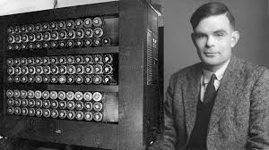
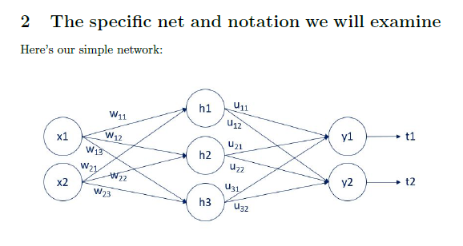
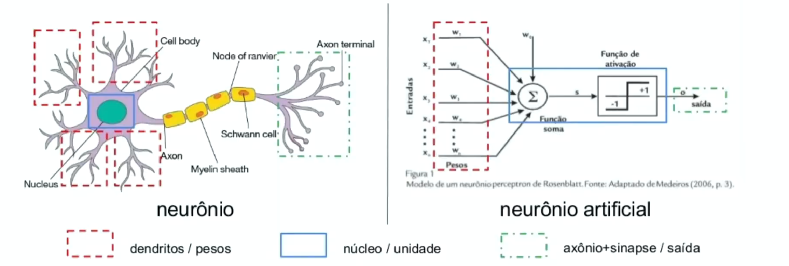

# IA
Here i gonna set a free material talking about AI and ML

Here is gonna be a json file with all learning, is gonna be talking AZURE, GEMINI and all
FEATURES OF AI

But lest start of history of ML

# 1950 - Alan Turing

 - [Article of the first thinking machine](https://archive.org/details/MIND--COMPUTING-MACHINERY-AND-INTELLIGENCE)

# Theory of Probability
- [PT Language](https://pt.wikipedia.org/wiki/Teoria_das_probabilidades)
 
 Fundamental of statistics was  build in century XVII.

 - The GOL: Analisys and model of data
 - [In 1800, Francis Galton e Karl Pearson. R. A. Fisher, Statistics Modern started](https://projecteuclid.org/journals/statistical-science/volume-7/issue-1/R-A-Fisher-The-Founder-of-Modern-Statistics/10.1214/ss/1177011442.full)

 # EDA Exploratory Data Analisys
 [EDA](https://en.wikipedia.org/wiki/Exploratory_data_analysis?utm_source=chatgpt.com)

 - In 1962, John Tukey, start the analisys exploration data, and bring a new era of ML
 [Buy the book](https://www.amazon.com/Exploratory-Data-Analysis-John-Tukey/dp/0201076160)
 - You can find the book free in alternative website, but recommended by the right way

## Document

#### ML Supervised learning

| Web site   | LINK                          |
| :---------- | :---------------------------------- |
| `JMLR` | https://www.jmlr.org/?utm_source=chatgpt.com|

| Web site   | LINK                          |
| :---------- | :---------------------------------- |
| `Springer` | https://link.springer.com/article/10.1007/s42979-021-00592-x?utm_source=chatgpt.com|

| Web site   | LINK                          |
| :---------- | :---------------------------------- |
| `AZURE ML` | https://ml.azure.com|

| Web site   | LINK                          |
| :---------- | :---------------------------------- |
| `AZURE ML` | https://microsoftlearning.github.io/mslearn-ai-fundamentals/Instructions/Labs/01-machine-learning.html|

| Web site   | LINK                          |
| :---------- | :---------------------------------- |
| `AZURE AI` | https://microsoftlearning.github.io/mslearn-ai-fundamentals/Instructions/Labs/02-content-safety.html|

## 🛠 Abilities
Python, R, Jupiter, and softwares of analysis...

 - [Python Documentation](https://docs.python.org/3/)
 - [R Documentationn](https://www.r-project.org/other-docs.html)
 - [Jupiter Documentationn](https://docs.jupyter.org/en/latest/)
 

## Learning

# Statistics

- Type of Data: Categorical and Numerical
- Categorical: YES OR NO, Logo of cars
- Numerical: Discrete ( Imagine each members of data set, number of children ) and Continues (Infinity and impossible to count, weight)

# Descriptive Statistics
- Qualitative is separete on Nominal and Ordinal
- Quantittive is separate in Interval and Ratio
- Mean, median, mode 
- Covariance and Correlation

## BASIC PROBABILITY
- Trial, Experiment , Experimental Probability, Expected Value
- Frequency
- Combinatorics (Permutations, Variations, Combinations)
- Factorials
- Bayesian Inference (Mutual Exclusive, Intersect, Union, Completely Overlap)
- Distributions (Discrete, Continuous)

The supervised machine, is when the machine is set data to mess with and find the best
solution to the target propose.

The unsupervised machine, is when the machine decid by data learned, by him self turn on new data 

Have one way that is the both sides, that human just give on sentence and the ML start the way, human can interfer but the computer give the last way

The Quantum Computing, gonna set a new Era of analysis data, my research about this is just in beginning

Reinforcement Learning.

AlphaGo (DeepMind)

[AlphaFold](https://deepmind.com/blog/article/alphafold)

[Quantum Microsoft](https://azure.microsoft.com/en-us/products/quantum/)

[Quantum Google](https://ai.google/research/teams/applied-science/quantum/)

[Quantum IBM](https://www.ibm.com/quantum-computing/)

[More of Quantum Computing](https://quantum.country/qcvc)

- On A neural network, is set by input layer, hiden layer, and output layer
- All layers is determined by maths functions

# BACKPROPAGATION

- There are Common activation functions like > Sigmoid (Logistic function) [Sigmoid](https://en.wikipedia.org/wiki/Sigmoid_function), TanH(Hyperbolic tangent) [TanH](https://en.wikipedia.org/wiki/Hyperbolic_function#Hyperbolic_tangent), ReLu(rectified linear unit) [RedLu](https://en.wikipedia.org/wiki/Rectifier_(neural_networks)) and [sofmat](https://en.wikipedia.org/wiki/Softmax_function)

# Cluster
- Is for a process of a lot of amount data, where are distribution for others computer. [Cluster](https://www.ibm.com/docs/pt-br/ibm-mq/9.2?topic=management-application-programming-clusters&utm_source=chatgpt.com)

- [Cluster 2](https://arxiv.org/abs/2207.05677?utm_source=chatgpt.com)

# RNA
- BUILDED OF PREDEFINED NEURONS
- Computional Neurons
- N -> IN

## BIBLIOGRAPHY

Bibliografia Básica

STEINBRUCH, A; WINTERLE, Paulo. ÁLGEBRA LINEAR. 2. ed. São Paulo: Pearson, 2014.

BRUCE, P; BRUCE, A. ESTATÍSTICA PRÁTICA: para cientistas de dados. 1. ed. Rio de Janeiro: Alta Books, 2019.

GONZALEZ, Rafael C; WOODS, Richard E. Processamento digital de imagens. 3. ed. São Paulo: Pearson, 2010.

GONZALEZ, R. C.; WOODS, R. E. Processamento de Imagens Digitais. São Paulo: Edgard Blücher, 2000.

PEDRINI, Hélio; SCHWARTZ, William Robson. Análise de imagens digitais: princípios, algoritmos e aplicações. São Paulo: Thomson Learning, 2008.

CASTLEMAN, Kenneth R. Digital image processing. Upper Saddle River, N. J.: Prentice-Hall, 1996.

FOLEY, J. D. Computer Graphics: Principles and Practices. 2nd ed. New York: Addison-Wesley, 1996.

Bibliografia Complementar

HEINY, Loren. Advanced graphics programming using C/C++. New York: John Wiley & Sons, 1993.

LYON, Douglas A. Image processing in Java. Upper Saddle River,NJ: Prentice-Hall, 1999

MATSUMOTO, Elia Yathie. MATLAB 7: fundamentos. São Paulo: Érica, 2004

## Author

- [@yuri](https://github.com/yutre021)

## 🚀 About me
I'm Computer Engeneering, with focous in AI ENGENEERING

## Roadmap

- Searchs 2025

- Get in Quantum Computing 

## Get in better

- If you have any sugestion just adm me

